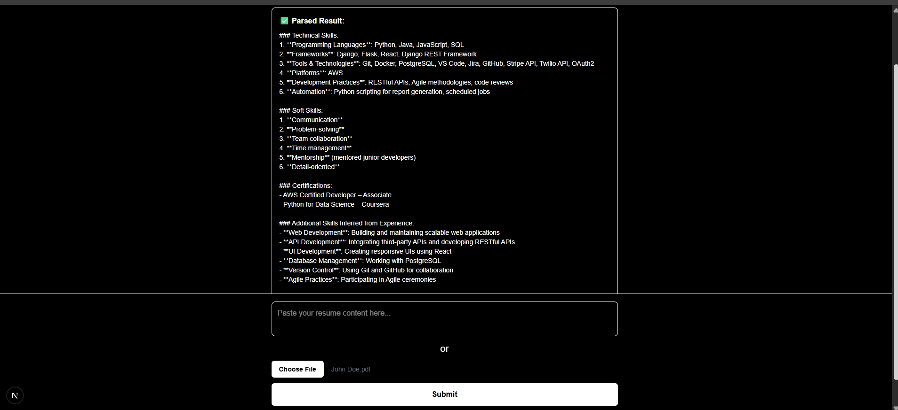

# 📄 AI Resume Parser

An AI-powered resume parser that extracts and analyzes resume content using NLP and machine learning. Built with Django REST Framework and Next.js, this full-stack app allows users to upload resumes and receive structured, meaningful insights — ideal for HR tools, job portals, or personal resume enhancement tools.

---
 
---
## 🧠 Key Features

- 📝 Upload resume files (PDF, DOCX, or text)
- 🤖 Extract name, skills, experience, education, contact info
- ✨ NLP-powered entity extraction and formatting
- 📊 Return structured JSON or display in a UI
- 🔐 JWT-based user authentication

---

## 🛠️ Tech Stack

### Backend:
- **Django + Django REST Framework**
- **Cohere API** for entity extraction and summarization
- **PyMuPDF / pdfplumber** or **python-docx** for file parsing
- **SimpleJWT** for token-based authentication

### Frontend:
- **Next.js (App Router)**
- **Tailwind CSS**
- **LocalStorage-based auth**
- **File upload UI and result viewer**

---

## 📂 Project Structure

